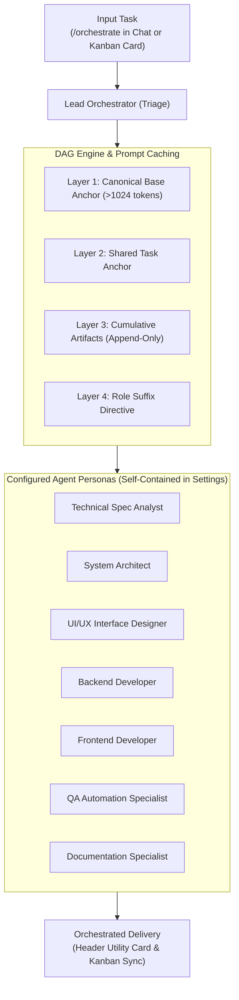

# 📦 @goodandready/dsh-agent-orchestrator

<div align="center">

<h3>Multi-Agent Task Decomposition, DAG Workflow Orchestration & Prompt Caching Engine for DeepSeek Harness</h3>

<p align="center">
  <a href="https://www.npmjs.com/package/@goodandready/dsh-agent-orchestrator"></a>
  <a href="LICENSE"></a>
  <a href="https://github.com/topics/dsh-plugin"></a>
  <a href="https://nodejs.org"></a>
</p>

<p align="center">
  <a href="https://goodandready.app/"></a>
</p>

<p align="center">
  <a href="README.md"><b>🇬🇧 English</b></a> •
  <a href="README.ru.md"><b>🇷🇺 Русский</b></a> •
  <a href="README.zh.md"><b>🇨🇳 中文说明</b></a>
</p>

<table align="center">
  <tr>
    <td align="center">
      ⭐ <strong>If you like this plugin, please star it on GitHub</strong> — it shows me that the plugin is useful to you and motivates me to keep developing it.
      <br><br>
      🐛 <strong>If you find a bug or would like to request a feature</strong>, open a GitHub issue in any language — I will review your proposal and implement useful suggestions in a future plugin version.
    </td>
  </tr>
</table>

</div>

---

## ⚡ Overview & The Problem

Single-agent software engineering architectures suffer from cognitive overload when tasked with complex multi-stage projects: monolithic prompts conflate architecture, styling, core business logic, testing, and documentation into a single generation pass, leading to hallucinated contracts, regression bugs, and excessive token expenditure.

Furthermore, executing multiple subagents independently often resets the LLM KV-cache on each turn, forfeiting prefix cache reuse and incurring substantial latency and financial overhead.

**`@goodandready/dsh-agent-orchestrator`** introduces an autonomous multi-agent orchestration framework to DeepSeek Harness:

1. **Intelligent Triage & Decomposition**: Analyzes high-level objectives from chat or Kanban cards and breaks them down into fine-grained stages across **12 specialized agent roles**.
2. **DAG Execution Engine**: Schedules tasks based on Directed Acyclic Graph dependencies, running independent stages concurrently while strictly enforcing blocker gates.
3. **KV-Cache / Prompt Caching Optimizer**: Guarantees byte-level prefix invariance for subagents sharing identical models, unlocking 80–90% prompt token cache hits and near-instant TTFT.
4. **Strict Separation of Duties**: Backend implementation, UI interface design, and frontend client assembly are strictly isolated into distinct personas and execution stages.
5. **Dual Surface Integration**: Dispatched natively via `/orchestrate` in DSH chat (with a sticky header milestone card) or via `@goodandready/dsh-kanban` task boards.

---

## 🏗️ Architecture



---

## 👥 12 Built-In Specialized Agent Roles

All agent profiles are **completely self-contained within plugin settings** (no external file dependencies):

| Role ID | Title | Specialization | Strict Boundaries |
|---|---|---|---|
| `spec` | Technical Spec Analyst | Requirements, Acceptance Criteria (DoD), Schemas | Never writes implementation or styling |
| `architecture` | System Architect | System Design, DESIGN.md, ADR, Modular Contracts | Never implements production code or deploys |
| `ui_design` | UI/UX Interface Designer | Layouts, Theme Tokens (`--dsw-alias-*`), Slots | Never writes backend Cordis services |
| `frontend` | Frontend Developer | React Components, Client Hooks, DOM Events | Never alters backend routes or DB schemas |
| `backend` | Backend Developer | Cordis Services, WebServer Routes, Data Store | Never writes client React JSX or styles |
| `fullstack` | Fullstack Integrator | Client-Server Contract Wiring, End-to-End Flow | Adheres strictly to modular limits |
| `qa_tests` | QA Automation Specialist | Unit Tests (`node:test`), Boundary Verification | Verifies without external network calls |
| `bugfix` | Hotfix & Triage Engineer | Root-Cause Diagnosis, Minimal Blast Radius Fixes | Never refactors unrelated code |
| `docs` | Documentation Specialist | Trilingual Documentation (en/ru/zh), Releases | Never overwrites previous documentation |
| `refactoring` | Refactoring Specialist | Complexity Reduction (YAGNI), Bundle Compression | Preserves backwards compatibility |
| `research` | Research & Spike Engineer | Technology Evaluation, Library Trade-Offs | Delivers analysis; never merges spike code |
| `devops` | DevOps & Tooling Engineer | Package Manifests, Build Verification, Systemd | Never exposes private network credentials |

---

## 🔄 Complexity Scenarios

1. **Hotfix / Trivial (1 Stage)**: Instant defect elimination or single-parameter tweak.
2. **Simple (2 Stages)**: Discussion & Spec $\rightarrow$ Targeted Execution.
3. **Medium (3–4 Stages)**: Spec $\rightarrow$ UI Design $\rightarrow$ Frontend Code $\rightarrow$ QA Tests.
4. **Complex (5–6 Stages)**: Spec $\rightarrow$ Architecture $\rightarrow$ UI Design $\rightarrow$ Implementation $\rightarrow$ QA $\rightarrow$ Trilingual Docs.
5. **Enterprise / Deep R&D (7 Stages)**: Spike Research $\rightarrow$ Spec $\rightarrow$ Architecture $\rightarrow$ Parallel Backend & UI Design $\rightarrow$ Frontend Assembly $\rightarrow$ Comprehensive QA $\rightarrow$ Documentation Gate.
6. **Custom DAG Scenarios**: Fully configurable in plugin settings with custom stages and blocker checkboxes.

---

## ⚡ Prompt Caching Mechanics

Modern LLMs (DeepSeek-V3, Claude 3.5 Sonnet, vLLM) cache prompt KV states strictly from the first token forward. If non-deterministic timestamps or random IDs are placed in the prompt header, cache hit rate drops to 0%.

`dsh-agent-orchestrator` enforces a **4-layer canonical layout**:
1. **Layer 1: Static Base Anchor (>1024 tokens)**: Byte-identical guidelines and tools definition common across all agents.
2. **Layer 2: Shared Task Anchor**: Stable description of user objective and target repository.
3. **Layer 3: Cumulative Context (Append-Only)**: Outputs of predecessor stages appended in a deterministic sequence, preserving 100% of the preceding KV-cache.
4. **Layer 4: Role Directive (Suffix)**: Role persona prompt, skills, and subtask-specific scope appended at the end.

This architecture delivers **80–95% cache hits** across subagents utilizing the same model, reducing TTFT and cutting token costs by ~90%.

---

## 💻 Usage

### 1. In DSH Chat via Slash Command
```text
/orchestrate Design and build a settings card for the finance plugin
```

Explicit scenario selection:
```text
/orchestrate complex Build a multi-tenant authentication provider
/orchestrate hotfix Fix null reference in store.js
```

Short alias:
```text
/orc Refactor state management
```

### 2. In @goodandready/dsh-kanban
- Open any card on the board.
- Click **[Собрать пайплайн / Assemble Pipeline]**.
- Select the complexity preset or allow auto-triage.
- The card automatically reflects stage transitions and advances to `Review` upon completion.

---

## 🧪 Verification & Automated Testing

Execute the native test suite (121 passing tests across 53 suites, zero network dependencies):

```bash
node --test test/*.test.mjs
```

Verify npm package bundle size compliance (<256 KiB threshold):

```bash
npm pack --dry-run --json
```

---

## Visual verification

Production acceptance of v0.1.6 — Settings card, Dark and Light themes side by side:


---

## 📄 License

MIT © [GooDAnDReaDY](https://github.com/GooDAnDReaDY)

