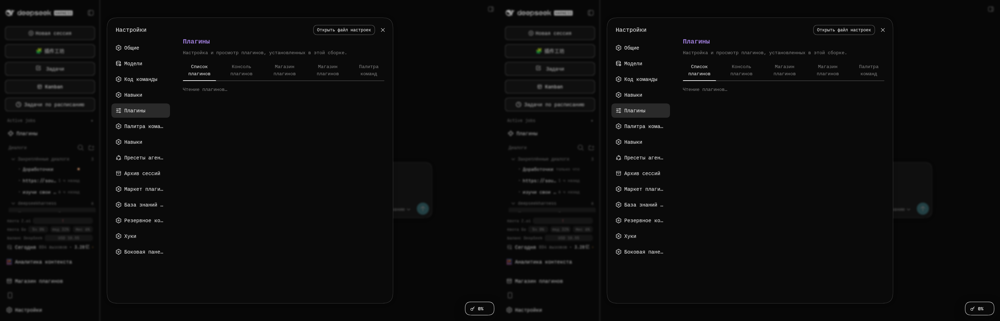

# 📦 @goodandready/dsh-agent-orchestrator

<h3>面向 DeepSeek Harness 的多智能体任务分解、DAG 工作流编排与提示词缓存优化引擎</h3>

  
  
  
  

  

  <a href="README.md"><b>🇬🇧 English</b></a> •
  <a href="README.ru.md"><b>🇷🇺 Русский</b></a> •
  <a href="README.zh.md"><b>🇨🇳 中文说明</b></a>

<table align="center">
  <tr>
    <td align="center">
      ⭐ <strong>如果您喜欢此插件，请在 GitHub 上点亮 Star</strong> — 这是对我持续投入开发的最大鼓励。
        
      🐛 <strong>若发现 Bug 或有功能建议</strong>，欢迎随时在 GitHub 提交 Issue（支持任意语言）— 我将在后续版本中积极评估并实现。
    </td>
  </tr>
</table>

---

## ⚡ 概述与解决的核心痛点

在执行复杂的多阶段工程任务时，单一智能体架构往往面临认知过载：在单一上下文请求中混合了系统架构、界面布局、前端交互、服务端逻辑、单元测试与文档编写，极易导致接口幻觉、功能退化与不必要的 Token 浪费。

此外，各子智能体的独立执行通常会中断大语言模型的 KV 缓存复用，失去前缀提示词缓存（Prompt Caching）的优势，产生严重的首次响应延迟 (TTFT) 与高昂的推理成本。

**** 为 DeepSeek Harness 提供完整的自主多智能体编排方案：

1. **智能分流与任务分解**：深度解析来自聊天或看板卡片的目标，拆解并分发给 **12 个专属智能体角色**。
2. **有向无环图 (DAG) 引擎**：基于依赖拓扑结构并行调度无阻塞子任务，严格保障阻断检查点。
3. **KV 缓存 / Prompt Caching 优化器**：确保同模型智能体之间保持字节级的前缀一致性，释放 80–90% 的缓存命中率并实现极速首字输出。
4. **严格的权责分离**：服务端后端、UI 界面设计与客户端前端实现各自保持独立的角色与执行阶段，杜绝单一智能体跨界混写。
5. **双场景原生集成**：支持在 DSH 聊天中通过  斜杠命令直接调用（带顶部吸顶里程碑卡片），亦可无缝接入  看板。

---

## 🏗️ 系统架构图

---

## 👥 12 大内置专属智能体角色矩阵

所有智能体预设均**完全内聚于插件设置面板中**（无需依赖本地额外配置文件）：

| 角色 ID | 角色名称 | 核心专业领域 | 严格职责边界 |
|---|---|---|---|
|  | 需求分析师 | 功能规范、验收准则 (DoD)、数据结构定义 | 严禁编写业务实现代码或样式 |
|  | 系统架构师 | 架构设计、DESIGN.md、ADR 决策、模块契约 | 严禁编写生产代码或执行部署 |
|  | UI/UX 设计师 | 界面布局、主题变量 ()、插槽设计 | 严禁编写服务端 Cordis 服务逻辑 |
|  | 前端工程师 | React 组件、客户端 Hooks、DOM 交互与事件 | 严禁修改后端路由或数据库存储 |
|  | 后端工程师 | Cordis 服务、WebServer 路由、状态与持久化 | 严禁编写客户端 React JSX 或前端 CSS |
|  | 全栈集成师 | 端到端契约对接、全链路串联打通 | 严格遵守模块化边界规范 |
|  | QA 自动化工程师 | 原生单元测试 ()、边界用例覆盖 | 仅限无外网依赖的纯净验证 |
|  | 缺陷修复专家 | 根因精准定位、最小爆炸半径修复 | 严禁重构无关代码 |
|  | 技术文档专家 | 英中俄三语文档编撰 (en/ru/zh)、发行注记 | 严禁覆盖或删除旧版有效文档 |
|  | 重构精简专家 | 复杂度裁剪 (YAGNI)、代码瘦身与体积压缩 | 必须严格保持向前兼容 |
|  | 前沿探索工程师 | 技术选型评估、多方案 Spike 对比验证 | 输出分析报告，严禁直接合并 Spike 代码 |
|  | 运维与工具工程师 | 包清单规范化、打包构建校验、systemd 守护 | 严禁泄露内部网络凭证与私钥 |

---

## 🔄 复杂度编排场景

1. **Hotfix / 紧急缺陷 (1 阶段)**：即时消除单一 Bug 或调整单项配置参数。
2. **Simple / 简易任务 (2 阶段)**：方案讨论与规范 $
ightarrow$ 靶向执行交付。
3. **Medium / 中型需求 (3–4 阶段)**：需求分析 $
ightarrow$ 界面设计 $
ightarrow$ 前端编码 $
ightarrow$ QA 自动化测试。
4. **Complex / 复杂项目 (5–6 阶段)**：需求分析 $
ightarrow$ 系统架构 $
ightarrow$ 界面设计 $
ightarrow$ 全栈实现 $
ightarrow$ QA 验收 $
ightarrow$ 三语文档。
5. **Enterprise / 深度研发 (7 阶段)**：技术评估 Spike $
ightarrow$ 需求分析 $
ightarrow$ 系统架构 $
ightarrow$ 后端与 UI 并行开发 $
ightarrow$ 前端集成 $
ightarrow$ 全面 QA $
ightarrow$ 文档网关验收。
6. **自定义 DAG 场景**：在插件设置面板自由增删阶段、配置依赖关系与阻断检查点。

---

## ⚡ 提示词缓存 (Prompt Caching) 底层原理

主流大语言模型严格从第一个 Token 开始构建并复用 KV 缓存。如果在 Prompt 开头混入不确定性的时间戳或随机 ID，缓存命中率将骤降至 0%。

 强制采用 **4 层规范化布局**：
1. **第 1 层：静态基础锚点 (>1024 Token)**：所有智能体共享的字节级完全一致的规则与工具说明。
2. **第 2 层：共享任务上下文锚点**：用户核心目标与目标仓库的稳定描述。
3. **第 3 层：阶段累计产物 (仅追加模式)**：前序阶段产物按确定性顺序追加，完全保留前置 KV 缓存。
4. **第 4 层：角色专属后缀指令**：智能体角色人设、技能指导与当前子任务专属指令置于最末端。

此架构能够使共享同一模型的子智能体达到 **80–95% 的缓存命中率**，极大降低首字生成延迟并将 Token 消耗降低约 90%。

---

## 💻 使用指南

### 1. 在 DSH 聊天中通过斜杠命令触发

显式指定复杂度预设：

简明别名：

### 2. 在 @goodandready/dsh-kanban 看板中协作
- 打开看板上的任意任务卡片。
- 点击 **[Собрать пайплайн / 装配工作流]**。
- 选择复杂度预设或采用自动分流。
- 任务卡片实时展示各阶段进度，任务完成自动推进至  状态。

---

## 🧪 自动化测试与打包验证

执行原生测试套件（121 个用例全部通过，零外部网络依赖）：

TAP version 13
1..0
# tests 0
# suites 0
# pass 0
# fail 0
# cancelled 0
# skipped 0
# todo 0
# duration_ms 4.966575

验证 npm 打包体积合规性（严格低于 256 KiB 上限）：

{
  "error": {
    "code": "ENOENT",
    "summary": "Could not read package.json: Error: ENOENT: no such file or directory, open '/home/migrate/package.json'",
    "detail": "This is related to npm not being able to find a file."
  }
}

---

## 🖼️ 视觉设计验收效果

v0.1.6 生产环境验收效果 — 设置面板暗色与亮色主题对照：

---

## 📄 开源协议

MIT © [GooDAnDReaDY](https://github.com/GooDAnDReaDY)
